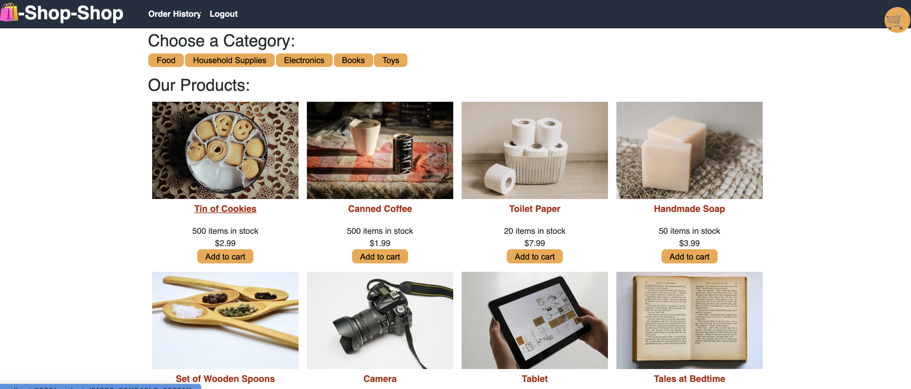

# shop-shop

This project was refactoring the front end from using React Reducer and Context to Redux.



|                                         |                                         |                                                   |
| :-------------------------------------: | :-------------------------------------: | :-----------------------------------------------: |
|       [Introduction](#shop-shop)        | [Table of Contents](#table-of-contents) | [Development Highlights](#development-highlights) |
|      [Installation](#installation)      |    [Page Directory](#page-directory)    |       [Code Hightlights](#code-highlights)        |
| [Technologies Used](#Technologies-Used) |           [Credits](#Credits)           |                [License](#License)                |

## Development Highlights

- Create Redux store, actions, and reducers.
- Dispatch actions to React front end components

## Installation

1. Install node modules

```
npm i
```

2. Start App

```
npm start
```

## Page Directory

### Client

There is a redux folder that stores the corresponding code for it. THe redux folder is divided into actions, store, and reducer.

## Code Highlights

Setting up the reducer.

```JavaScript
const reducer = (state = intialState, action) => {
    switch (action.type) {
        case UPDATE_PRODUCTS:
            return {
                ...state,
                products: [...action.products],
            };

        case ADD_TO_CART:
            return {
                ...state,
                cartOpen: true,
                cart: [...state.cart, action.product],
            };

        case ADD_MULTIPLE_TO_CART:
            return {
                ...state,
                cart: [...state.cart, ...action.products],
            };

        case UPDATE_CART_QUANTITY:
            return {
                ...state,
                cartOpen: true,
                cart: state.cart.map(product => {
                    if (action._id === product._id) {
                        product.purchaseQuantity = action.purchaseQuantity
                    }
                    return product
                })
            };

        case REMOVE_FROM_CART:
            let newState = state.cart.filter(product => {
                return product._id !== action._id;
            });

            return {
                ...state,
                cartOpen: newState.length > 0,
                cart: newState
            };

        case CLEAR_CART:
            return {
                ...state,
                cartOpen: false,
                cart: []
            };

        case TOGGLE_CART:
            return {
                ...state,
                cartOpen: !state.cartOpen
            };

        case UPDATE_CATEGORIES:
            return {
                ...state,
                categories: [...action.categories],
            };

        case UPDATE_CURRENT_CATEGORY:
            return {
                ...state,
                currentCategory: action.currentCategory
            }

        default:
            return state;
    }
};
```

Dispatching the remove to cart action.

```JavaScript
    const removeFromCart = item => {
        dispatch({
            type: REMOVE_FROM_CART,
            _id: item._id
        });
        idbPromise('cart', 'delete', { ...item });

    };

```

## Technologies

### Redux

- [react-redux](https://react-redux.js.org/)
- [redux](https://redux.js.org/)

## Credits

The starter code was provided by 2U bootcamp.

|                           |                                                                                                                                                                                                       |
| ------------------------- | ----------------------------------------------------------------------------------------------------------------------------------------------------------------------------------------------------- |
| **David Anusontarangkul** | [ LinkedIn](https://www.linkedin.com/in/anusontarangkul/) [ GitHub](https://github.com/anusontarangkul) |

## License

[](https://opensource.org/licenses/MIT)
